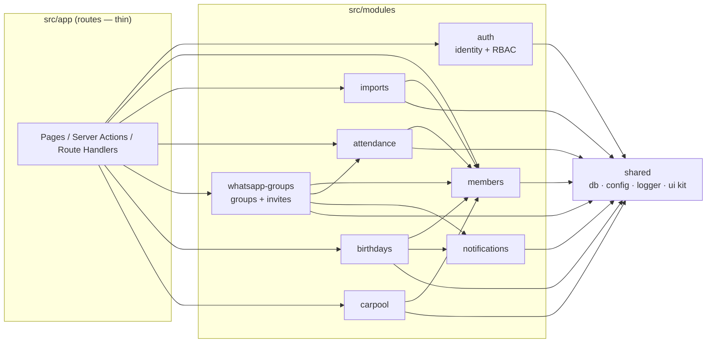
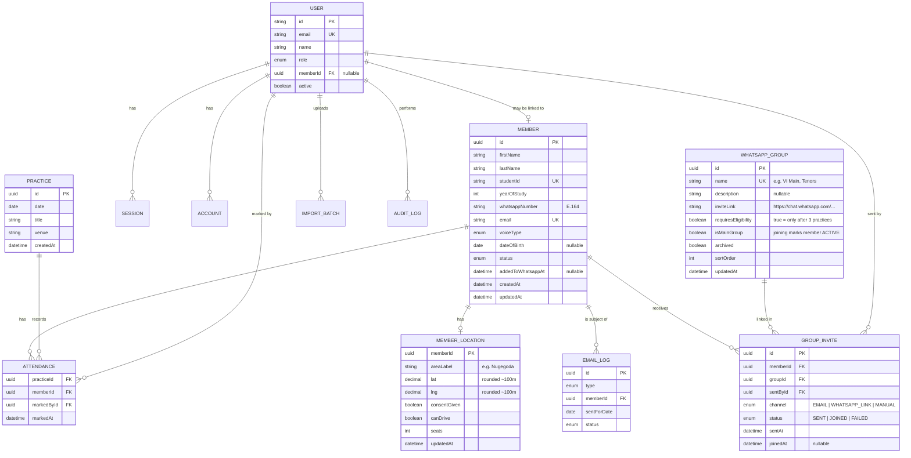

# Vocal Impact Choir App — Project Blueprint

> Single source of truth for **what** we are building, **with what**, and **how**.
> Update this document (or add an ADR in `docs/adr/`) whenever a decision changes.

| | |
|---|---|
| **Status** | v1.0: Phases 0–3 implemented (see §10). Phase 4 not started |
| **Last updated** | 2026-10-02 (implementation notes added; see §13) |
| **Owner** | Vocal Impact committee (IIT) |
| **Budget** | LKR 0 — open-source tools and free tiers only, no card on file anywhere |

---

## Table of contents

1. [Overview & scope](#1-overview--scope)
2. [Tech stack](#2-tech-stack)
3. [Architecture](#3-architecture)
4. [Data model](#4-data-model)
5. [Feature specifications](#5-feature-specifications)
6. [Authentication & authorization](#6-authentication--authorization)
7. [Security & privacy](#7-security--privacy)
8. [Environments, hosting & operations](#8-environments-hosting--operations)
9. [Coding standards & workflow](#9-coding-standards--workflow)
10. [Roadmap](#10-roadmap)
11. [Open questions](#11-open-questions)
12. [Appendix](#12-appendix)

---

## 1. Overview & scope

### 1.1 Problem

The committee manages choir members across Google Forms, spreadsheets and WhatsApp. Specifically:

- Member details arrive as a **Google Form CSV export** and live in spreadsheets.
- New members must attend **3 practices** before being added to the main WhatsApp groups; this is tracked by hand.
- Birthdays get missed.
- Carpooling to and from practices is arranged ad hoc.

### 1.2 Goals

| # | Goal | Success looks like |
|---|---|---|
| G1 | Central member registry | Import the Google Form CSVs in under a minute, with no duplicates. Add a single new member by hand in under 30 seconds |
| G2 | New-member attendance tracking | The committee sees an up-to-date "Ready for WhatsApp" list |
| G2b | WhatsApp group invites | The committee picks which groups a member should join and sends them the invite links by email or a pre-filled WhatsApp message, in a few taps |
| G3 | Birthday dashboard and reminders | Nobody's birthday is missed. Subscribed committee members get an email on the morning of each birthday |
| G4 | Carpool support | A map of approximate member locations, suggested carpool groups, and a one-click Google Maps route |
| G5 | Sustainability | The next committees can run, host and extend it for several years at no cost |

### 1.3 Non-goals (for now)

- Payments, fees or ticketing.
- Public sign-up. Every user is pre-approved.
- Automating WhatsApp, meaning adding people to groups or sending messages from a bot. This breaks WhatsApp's terms and the official Business API is paid. Instead, the app **prepares invite messages** (email, or a pre-filled `wa.me` chat that a committee member sends by hand). See §5.3.
- Native mobile apps. The web app is mobile-first and responsive.

### 1.4 Users & roles

| Role | Who | v1 access |
|---|---|---|
| **Admin** | President / tech lead (1–3 people) | Everything, including managing users, roles and settings |
| **Committee** | Committee members, section leaders | Manage members, imports, practices and attendance. View birthdays and carpool |
| **Member** | Choir members | *Phase 4:* sign in to view and update their own profile (birthday, location, carpool preferences) |

### 1.5 Glossary

| Term | Meaning |
|---|---|
| **Prospective member** | Imported or added, but not yet in the main WhatsApp groups |
| **Practice** | A dated choir session where attendance is taken |
| **Eligible** | A prospective member who has attended at least `attendanceThreshold` practices (default **3**) |
| **Active member** | Has been added to the main WhatsApp groups |
| **WhatsApp group** | A choir WhatsApp group the committee has registered in the app: a name plus its invite link |
| **Invite** | A record that a member was sent the link(s) to one or more WhatsApp groups, and by which channel |
| **Carpool group** | A suggested set of members who live close together or along one route, with at least one driver |

---

## 2. Tech stack

Every item below is **open source or a free tier that needs no credit card**.

| Concern | Choice | Why |
|---|---|---|
| Language | **TypeScript** (strict mode) | One language end to end. Types catch errors early and help future maintainers |
| Framework | **Next.js** (App Router, React Server Components, Server Actions) | UI and API ship as **one deployable**, which suits a modular monolith. Large community and docs |
| UI | **Tailwind CSS** + **shadcn/ui** (Radix primitives) | Accessible, consistent and easy to restyle. The components are copied into the repo, so there is no lock-in |
| Forms | Native forms + React `useActionState` + Server Actions | Work without client JS, with less code. Validation runs on the server with the shared Zod schemas |
| Validation | **Zod** | One schema per entity, reused by forms, the CSV import and server actions |
| Database | **PostgreSQL** on **Neon** (free tier) | Real relational DB. The free tier scales to zero and wakes on request (Supabase's free tier *pauses* projects after a week of inactivity, which would bite during vacations). DB branching gives preview environments |
| ORM / migrations | **Prisma** + Prisma Migrate | A readable schema file, versioned migrations, and the best docs for rotating student maintainers |
| Authentication | **Better Auth** (Google social provider, Prisma adapter) | Open source (MIT) and actively maintained. It is now the home of the former Auth.js/NextAuth project. Supports DB sessions and custom user fields (role) |
| Email | **Nodemailer** over **Gmail SMTP** (committee IIT Google account + App Password), plain-text and HTML templates in `modules/notifications` | Free, with a daily limit far above our needs. Fallback if IIT blocks App Passwords: **Brevo** SMTP (300/day free) |
| Scheduled jobs | **Vercel Cron** (Hobby: once a day), calling `/api/cron/*` with a `CRON_SECRET` | Free. A daily birthday check fits the Hobby limit. Backup trigger: a scheduled GitHub Actions workflow |
| Maps (display) | **Leaflet** + **react-leaflet** with **OpenStreetMap** tiles | Free with no API key. Google Maps Platform needs a billing account, which we avoid |
| Geocoding | **Nominatim** (OSM) | Free. Usage policy: at most 1 request per second, a custom User-Agent, and cached results |
| Routing | **OpenRouteService** (free API key, about 2,000 directions a day) | Route distance and duration for carpool v2 |
| Navigation | **Google Maps URL deep links** (`https://www.google.com/maps/dir/?api=1&…`) | Free and needs no API key. Opens directions in the Google Maps app |
| CSV parsing | **PapaParse** | Handles quoting, BOMs and odd line endings in Google Sheets exports |
| Phone numbers | **libphonenumber-js** (default region `LK`) | Normalises WhatsApp numbers to E.164 (`+9477…`) |
| Dates | **date-fns** + **@date-fns/tz** | Birthday maths in `Asia/Colombo` time |
| Hosting | **Vercel** (Hobby plan) | Free. Deploys on git push and gives every PR a preview URL. The Hobby plan is for non-commercial use, which a university society is |
| Source control / CI | **GitHub** (organisation owned by the choir) + **GitHub Actions** | Free for our usage |
| Testing | **Vitest**, **Testing Library**, **Playwright** | Fast unit tests, component tests and end-to-end tests |
| Code quality | **ESLint** (module boundaries via `no-restricted-imports`), **Prettier**, **Husky** + **lint-staged**, **commitlint** | Consistent style, module boundaries enforced, Conventional Commits |
| Package manager | **npm** | Ships with Node, so there is nothing extra to install for new maintainers |
| Local database | **embedded-postgres** (`npm run db:local`) | Real PostgreSQL with no Docker, which also works on Windows laptops |
| Runtime | **Node.js LTS** | Pinned in `.nvmrc` and `package.json#engines` |

> **Why not Google Maps in-app?** Every Google Maps Platform API (JS, Geocoding, Directions, even the free Embed tier) requires a Cloud billing account with a card attached. We use OSM in the app and hand off to Google Maps through plain URLs, so members still navigate in the app they know.

---

## 3. Architecture

### 3.1 Style: modular monolith

- **One codebase, one deployable, one database.** It is simple to host for free and simple for a student team to reason about.
- Code is split into **feature modules** with explicit public APIs and enforced boundaries. A module could be extracted later, but we will most likely never need to.
- **Next.js route files stay thin.** Pages, layouts, server actions and route handlers only parse input, check permissions, call a module's application service and render the result.



**Dependency rules** (enforced by ESLint `no-restricted-imports` in `eslint.config.mjs`):

1. `app/` may import any module's **public `index.ts`** and nothing deeper.
2. Modules may import other modules **only through their `index.ts`**, and only along the arrows above (no cycles).
3. Every module may import `shared/`. `shared/` imports no module.

### 3.2 Layers inside a module

```
modules/attendance/
├── domain/            # Pure TypeScript. No Next.js, no Prisma, no I/O.
│   ├── attendance.ts          # types / value objects
│   └── eligibility.ts         # isEligibleForWhatsApp(count, threshold)
├── application/       # Use cases. Orchestrate domain + repositories through interfaces.
│   ├── mark-attendance.ts
│   └── list-eligible-members.ts
├── infrastructure/    # Adapters: Prisma repositories, external APIs.
│   └── prisma-attendance-repository.ts
├── ui/                # React components owned by this feature.
│   └── attendance-checklist.tsx
├── schemas.ts         # Zod schemas (input DTOs)
└── index.ts           # PUBLIC API. The only file other code may import.
```

| Layer | May depend on | Must not |
|---|---|---|
| `domain` | nothing (except `shared/lib` utilities) | touch the DB, network, framework or `Date.now()` directly (pass "now" in) |
| `application` | `domain`, repository/port **interfaces** | import Prisma or Next.js |
| `infrastructure` | `application` interfaces, Prisma, SDKs | contain business rules |
| `ui` | `application` via server actions, `shared/ui` | query the DB directly |

### 3.3 Design principles

- **Single responsibility.** One use case per file in `application/`.
- **Dependency inversion for anything external.** `EmailSender`, `Geocoder`, `RouteProvider` and `Clock` are interfaces, and the production adapters are wired in one composition file per module. Changing Gmail to Brevo, or Nominatim to another geocoder, touches one file. Tests use in-memory fakes.
- **One schema per concept.** Zod schemas are the single definition of valid input. TypeScript types are inferred from them (`z.infer`).
- **Pure domain rules.** Eligibility, birthday maths, CSV row validation and carpool clustering are pure functions, so they are trivial to unit test.
- **Explicit errors.** Expected failures (validation, not found, forbidden) are returned as a typed `Result<T, AppError>`. Exceptions are for bugs.
- **YAGNI.** No microservices, message queues, Redis or GraphQL. Add complexity only when a real need appears, and record it as an ADR.
- **Configuration over code.** Values like the attendance threshold, reminder time and practice venue live in the `Setting` table and are editable by admins.

### 3.4 Folder structure

```
vocal-impact-app/
├── .github/workflows/          # ci.yml, cron-backup.yml, db-backup.yml
├── docs/
│   ├── PROJECT_BLUEPRINT.md    # this file
│   ├── adr/                    # 0001-modular-monolith.md, 0002-osm-over-google-maps.md, …
│   └── HANDOVER.md             # account ownership & yearly handover checklist
├── prisma/
│   ├── schema.prisma
│   ├── migrations/
│   └── seed.ts                 # dev seed data (fake people only)
├── public/
├── src/
│   ├── app/
│   │   ├── (auth)/sign-in/
│   │   ├── (dashboard)/
│   │   │   ├── page.tsx                # home: today's birthdays, eligible members, next practice
│   │   │   ├── members/                # list, detail, add, edit, import
│   │   │   ├── attendance/             # practices, take attendance, eligibility list
│   │   │   ├── whatsapp-groups/        # manage groups & links, invite history
│   │   │   ├── birthdays/
│   │   │   ├── carpool/
│   │   │   └── settings/               # users & roles, reminder recipients, thresholds (admin)
│   │   └── api/
│   │       ├── auth/[...all]/route.ts  # Better Auth handler
│   │       ├── cron/daily/route.ts    # birthday reminders + geocoding
│   │       └── health/route.ts
│   ├── modules/
│   │   ├── auth/  members/  imports/  attendance/  whatsapp-groups/
│   │   ├── birthdays/  carpool/  notifications/
│   └── shared/
│       ├── db/                 # Prisma client singleton
│       ├── config/             # env parsing with Zod (fails fast on missing vars)
│       ├── lib/                # result.ts, errors.ts, dates.ts, logger.ts
│       └── ui/                 # shadcn/ui components, layout shell
├── tests/
│   ├── e2e/                    # Playwright
│   └── fixtures/               # sample CSVs (fake data)
├── .env.example
├── .nvmrc
├── eslint.config.mjs
├── vercel.json                 # cron schedule
└── package.json
```

Unit tests sit next to the code they test (`eligibility.test.ts` beside `eligibility.ts`).

---

## 4. Data model

### 4.1 Entity-relationship diagram



### 4.2 Key rules & constraints

| Entity | Rule |
|---|---|
| `Member.studentId` | Unique. The **natural key for CSV upserts** |
| `Member.email` | Unique, lowercased, must end with the IIT domain (configurable) |
| `Member.whatsappNumber` | Stored in E.164 form (`+94771234567`) |
| `Member.voiceType` | Enum `SOPRANO \| ALTO \| TENOR \| BASS` (see the open questions) |
| `Member.status` | `PROSPECTIVE → ACTIVE → INACTIVE / ALUMNI`. Every transition is audit-logged |
| `Attendance` | Composite PK `(practiceId, memberId)`, so a member cannot be marked twice |
| `MemberLocation` | Only stored when `consentGiven = true`. Coordinates rounded to 3 decimal places (about 100 m) |
| `EmailLog` | Unique `(type, memberId, sentForDate)`, so a cron retry never sends twice |
| `WhatsAppGroup.inviteLink` | Must match `https://chat.whatsapp.com/<code>`. Treated as **sensitive**: only Admin/Committee can see it. Editable, because WhatsApp lets admins reset links |
| `WhatsAppGroup` | Archived rather than deleted, so invite history stays intact |
| `GroupInvite` | One row per member per group per send. Re-sending creates a new row, so the history shows every send |
| `Member.source` | `CSV_IMPORT \| MANUAL`, recorded for traceability |
| `Setting` | Key/value with typed accessors: `attendanceThreshold` (3), `reminderHourLocal` (7), `practiceVenue` ({name, lat, lng}), `allowedEmailDomain` |
| `ImportBatch` | `fileName`, `uploadedById`, `createdCount`, `updatedCount`, `skippedCount`, `errors (json)`, `createdAt` |
| `AuditLog` | `actorId`, `action`, `entity`, `entityId`, `diff (json)`, `createdAt` |
| Deletes | Members are **soft-deleted** by default (`deletedAt`). Hard delete is admin-only, for data-removal requests |

---

## 5. Feature specifications

### 5.1 Members & CSV import (`members`, `imports`)

**Source columns** (Google Form export). Header matching is case- and whitespace-insensitive:

| CSV header | Field | Validation / transform |
|---|---|---|
| `Timestamp` | — | ignored |
| `First Name` | `firstName` | trimmed, title-cased, 1–50 chars |
| `Last Name` | `lastName` | trimmed, title-cased, 1–50 chars |
| `IIT Student ID` | `studentId` | trimmed, uppercased, pattern configurable |
| `Current Year of Study` | `yearOfStudy` | accepts "1", "1st Year", "Year 1" and similar; maps to 1–5 |
| `WhatsApp Number` | `whatsappNumber` | libphonenumber-js, region `LK`, rejects invalid numbers |
| `IIT Email Address` | `email` | lowercased, valid email, IIT domain |
| `What is your voice type?` | `voiceType` | case-insensitive map to the enum; "Not sure" becomes `UNASSIGNED` |
| *(optional)* `Date of Birth` | `dateOfBirth` | accepted if the column exists |
| *(optional)* `Area you live in` | `MemberLocation.areaLabel` | accepted if the column exists, geocoded later |

**Import flow:**

1. **Upload** a CSV (max 1 MB, `text/csv`).
2. **Parse and validate** every row with Zod. Nothing is written yet.
3. **Preview**, grouped into tabs: **New** (studentId not found), **Updated** (field-level diff shown), **Unchanged**, **Invalid** (row number and reason), and **Duplicate in file**.
4. **Confirm** to commit inside a single DB transaction. New members get `status = PROSPECTIVE`. An `ImportBatch` row is recorded.
5. A summary is shown and the invalid rows can be downloaded as a CSV to fix and re-upload.

**Supplementary details form (decided).** The registration form has no date of birth or location, so the committee will send a **second Google Form** to members. Its CSV is imported through the same pipeline using a second **import profile**. Rows are matched to existing members by **IIT Student ID**; rows with an unknown ID are listed as invalid and never create members.

| Supplementary CSV header (proposed) | Field | Validation / transform |
|---|---|---|
| `IIT Student ID` | match key | must exist in `Member` |
| `Date of Birth` | `dateOfBirth` | Google Forms date (`M/D/YYYY` or `YYYY-MM-DD`), age 15–40 sanity check |
| `Which area do you live in?` | `MemberLocation.areaLabel` | trimmed, geocoded later |
| `Can we use your approximate location for carpooling?` | `MemberLocation.consentGiven` | `Yes` / `No`. Location fields are discarded unless `Yes` |
| `Can you drive to practices?` | `canDrive` | `Yes` / `No` |
| `How many passengers can you take?` | `seats` | 0–6 |

Import profiles live in `modules/imports/domain/profiles/` (`registration.ts`, `supplementary-details.ts`). Each one is a header map plus a Zod row schema, so a future form only needs a new profile file.

**Adding a single member manually.** An **"Add member"** button on the members list opens a form with the same fields and the same Zod schema as the CSV import. Before saving, it checks for duplicates by student ID, email and WhatsApp number, and shows "This person already exists → open profile" when one matches. New members default to `status = PROSPECTIVE` and `source = MANUAL`. After saving, the committee can choose **"Save & send group invites"** to go straight to §5.3.

**Member list:** search by name, student ID or email. Filter by status, voice type and year. Export to CSV. The member detail page shows profile, attendance history, location and an audit trail.

### 5.2 Attendance & WhatsApp eligibility (`attendance`)

- **Practices:** create a practice (date, title, venue). "Start today's practice" is one tap.
- **Taking attendance** (mobile-first): a searchable list of members with large tap targets. Prospective members are pinned to the top and show a badge such as `2/3`. Marking is optimistic and saved through a server action. Unmarking is allowed on the same day.
- **Eligibility rule** (pure domain function):

  ```ts
  isEligibleForWhatsApp = member.status === 'PROSPECTIVE'
                       && attendedPracticeCount >= settings.attendanceThreshold
  ```

- **"Ready for WhatsApp" list** on the dashboard: name, voice type and WhatsApp number, with a **"Send group invites"** action per person and in bulk (see §5.3). The committee can also click **"Mark as added"** directly, for example when they added the person from their phone. This sets `status = ACTIVE` and `addedToWhatsappAt = now`, and writes an audit log entry.
- **Reports:** attendance per practice, attendance per member, and members who stopped coming (no attendance in N weeks).
- *Later:* QR self check-in, using a rotating per-practice code shown on the committee phone to prevent sharing.

### 5.3 WhatsApp groups & invites (`whatsapp-groups`)

**Managing groups** (Settings → WhatsApp groups, Admin only):

- A list of the choir's groups. Each has a **name**, an optional **description**, the **invite link** (`https://chat.whatsapp.com/…`) and two flags:
  - **Requires eligibility:** the group is only for members with 3 or more practices (e.g. *VI Main*). Groups like *VI Newcomers* can be open from day one.
  - **Main group:** when an invite to this group is marked *Joined*, the member becomes `ACTIVE`.
- Groups can be added, edited (e.g. when a link is reset in WhatsApp), reordered and archived. Every change is audit-logged.
- There is an **invite message template**, editable in Settings with placeholders:

  ```
  Hi {firstName}! 🎶 Welcome to Vocal Impact.
  Here are the WhatsApp groups to join:
  {groupList}
  See you at the next practice!
  ```

  `{groupList}` renders as `• VI Main — https://chat.whatsapp.com/…`, one line per selected group.

**Sending invites** (Admin and Committee). This is available from the member profile, the "Ready for WhatsApp" list (single or bulk select), and right after "Save & send group invites" on the Add member form:

1. **Choose groups** from checkboxes listing every non-archived group. Groups the member already joined are shown as ticked and disabled. Groups that **require eligibility** are disabled for members below the threshold, with a tooltip such as "2/3 practices". An Admin can override this, and the override is audit-logged.
2. **Preview** the rendered message.
3. **Choose a channel:**

   | Channel | How it works | Cost / compliance |
   |---|---|---|
   | **Email** | Sent from the choir address to the member's IIT email via `notifications`. Supports **bulk** sending to many selected members | Free (Gmail SMTP) |
   | **WhatsApp (pre-filled)** | Opens `https://wa.me/<E.164 without +>?text=<url-encoded message>` in a new tab. WhatsApp opens on the committee member's phone or WhatsApp Web with the message ready, and they press Send. **One member at a time** | Free and within WhatsApp's terms, because a human sends it |
   | **Copy message** | Copies the text to the clipboard to paste anywhere | Free |

4. A `GroupInvite` row is recorded per selected group with `status = SENT`. Email failures are recorded as `FAILED` with a retry button.

**Tracking joins.** The member profile shows each group with its status (*Not invited*, *Invited (date, channel, by whom)*, *Joined*). A committee member ticks **"Joined"** once they see the person in the group, because WhatsApp offers no free way to detect this automatically. Ticking *Joined* on a **main group** sets `status = ACTIVE` and `addedToWhatsappAt` (the same as "Mark as added").

**Rules (pure domain functions, unit tested):** `canInviteToGroup(member, group, attendedCount, threshold)`, `renderInviteMessage(template, member, groups)`, and `buildWaMeUrl(phoneE164, message)`.

### 5.4 Birthdays (`birthdays`, `notifications`)

- **Dashboard widgets:** 🎂 today, the next 7 days, and this month. A month calendar view sits on `/birthdays`.
- **Birthday maths** (pure, tested):
  - Computed against the **`Asia/Colombo` local date**, never UTC.
  - A 29 February birthday is celebrated on **28 February** in non-leap years.
  - Members with no DOB are excluded and counted in a "missing birthdays" nudge.
- **Daily reminder job:**
  1. Vercel Cron calls `GET /api/cron/daily` daily. The same run also geocodes queued carpool areas. The schedule is set in UTC in `vercel.json`: `30 1 * * *` is 07:00 Sri Lanka time.
  2. The route checks `Authorization: Bearer ${CRON_SECRET}`.
  3. It finds today's birthdays. For each one, it **inserts an `EmailLog` row first**; the unique constraint makes retries safe. It then emails every active user with `receivesBirthdayReminders = true`.
  4. One digest email is sent per recipient, listing all of today's birthdays.
  5. Failures are logged with `status = FAILED` and retried on the next manual or cron run.
- **Recipients** are managed by admins in Settings (opt-in per committee user).
- *Later:* an optional "happy birthday" email to the member themself, and a weekly digest.

### 5.5 Carpool (`carpool`)

- **Location capture:** an area name (e.g. "Dehiwala") and optionally a pin dropped on a Leaflet map. Geocoding goes through Nominatim on the server, throttled and cached. Members can choose **"I can drive"** and set the number of seats. Location is never stored without consent.
- **Map view:** member markers using approximate coordinates, clustered with `leaflet.markercluster`, plus the practice venue marker. Committee only in v1.
- **Suggestions v1 (distance-based):**
  1. Compute the haversine distance from each member to the venue.
  2. Group members whose homes are within `R` km of each other (default 3 km) using simple greedy clustering. Each group is anchored on a driver when one exists.
  3. Fill each driver's seats with the nearest unassigned members whose detour, estimated with straight-line distance, is under `D` km.
- **Suggestions v2 (route-based):** fetch the driver → venue route from OpenRouteService and match passengers within a corridor (e.g. 1.5 km) of the route polyline.
- **"Open in Google Maps"** button per group:

  ```
  https://www.google.com/maps/dir/?api=1
    &origin=<driverLat>,<driverLng>
    &destination=<venueLat>,<venueLng>
    &waypoints=<p1Lat>,<p1Lng>|<p2Lat>,<p2Lng>
    &travelmode=driving
  ```

- The output is suggestions only. Members still coordinate in WhatsApp.

### 5.6 Home dashboard

One screen for the committee: today's birthdays, members ready for WhatsApp (with pending invites), the next or today's practice with a "Take attendance" button, recent imports, and counts (active, prospective, missing DOB, missing location).

---

## 6. Authentication & authorization

### 6.1 Authentication

- **Better Auth** with the **Google** provider. IIT runs on Google Workspace, so members already have Google accounts.
- **Allowlist (v1):** a sign-in succeeds only if the email already exists in the `User` table with `active = true` (pre-created by an admin). Everyone else sees "Not authorised — contact the committee".
- **Phase 4:** any verified `@<IIT domain>` Google account whose email matches a `Member` is automatically given a `MEMBER` user linked to that member.
- Sessions are stored in the DB (revocable) in HTTP-only, `Secure`, `SameSite=Lax` cookies. Idle sessions expire after 7 days.
- **Bootstrap:** the first admin is created by a one-off seed script (`npm run db:seed-admin -- --email …`).

### 6.2 Authorization (RBAC)

Permissions are checked **on the server for every action and route**. The UI only hides buttons as a convenience.

| Permission | Admin | Committee | Member (Phase 4) |
|---|:-:|:-:|:-:|
| `members:read` (all) | ✅ | ✅ | ❌ (own only) |
| `members:write` | ✅ | ✅ | own profile fields only |
| `members:delete` | ✅ | ❌ | ❌ |
| `imports:run` | ✅ | ✅ | ❌ |
| `groups:manage` (add/edit links) | ✅ | ❌ | ❌ |
| `groups:read` (see invite links) | ✅ | ✅ | ❌ |
| `invites:send` / `invites:mark-joined` | ✅ | ✅ | ❌ |
| `invites:override-eligibility` | ✅ | ❌ | ❌ |
| `attendance:read` | ✅ | ✅ | own only |
| `attendance:write` | ✅ | ✅ | ❌ |
| `birthdays:read` | ✅ | ✅ | ✅ (names and day only) |
| `carpool:read` | ✅ | ✅ | own group only |
| `users:manage` / `settings:manage` | ✅ | ❌ | ❌ |
| `audit:read` | ✅ | ❌ | ❌ |

Implementation:

```ts
// modules/auth/domain/permissions.ts — single map of role → permissions
// modules/auth/application/require-permission.ts
export async function requirePermission(permission: Permission): Promise<SessionUser> { /* throws/redirects */ }

// usage in a server action
export async function markAttendanceAction(input: unknown) {
  const user = await requirePermission('attendance:write');
  const data = markAttendanceSchema.parse(input);
  return markAttendance({ ...data, markedById: user.id });
}
```

- The Next.js **proxy** (`src/proxy.ts`; Next 16 renamed middleware to proxy) only checks that a session cookie exists and redirects to `/sign-in`. Fine-grained checks happen in `requirePermission`, because a proxy alone is not a security boundary. Better Auth also rate-limits sign-in attempts.
- **Cron routes** authenticate with `CRON_SECRET`, not a user session.

---

## 7. Security & privacy

The app holds personal data (phone numbers, birthdays, approximate home locations) and falls under **Sri Lanka's Personal Data Protection Act No. 9 of 2022**.

| Area | Measure |
|---|---|
| Data minimisation | Only collect what a feature needs. Store approximate locations (area plus coordinates rounded to about 100 m), never full addresses |
| Consent | `consentGiven` flag on location, with a consent line added to the Google Form. Members can ask for their data to be removed |
| Access control | RBAC as above. Phone numbers, DOB and location are never shown on public pages. There are no public pages besides sign-in |
| Secrets | Only in Vercel/GitHub environment variables. `.env*` is git-ignored. Env vars are validated with Zod at boot |
| Transport | HTTPS everywhere (Vercel default) plus an HSTS header |
| Headers | CSP, `X-Frame-Options: DENY`, `Referrer-Policy: strict-origin-when-cross-origin`, set in `next.config` |
| Input | All input validated with Zod on the server. Prisma parameterises queries. CSV upload limited by size and type |
| CSRF | Server Actions have built-in origin checks. Better Auth handles its own endpoints |
| Abuse limits | Nominatim calls throttled to 1/s and cached in the DB. Imports limited to admin/committee |
| Invite links | WhatsApp invite links let anyone join a group, so they are never shown outside Admin/Committee pages, never logged, and only sent to the selected member's own email or number. If a link leaks, reset it in WhatsApp and update it in Settings |
| Auditability | `AuditLog` for member status changes, imports, role changes, deletions, WhatsApp group edits and eligibility overrides |
| Data subject requests | Per-member CSV export and admin hard delete |
| Dev data | Seeds and test fixtures use **fake people only**. Never commit real CSVs (`*.csv` is git-ignored outside `tests/fixtures/`) |
| Dependencies | GitHub Dependabot alerts and `npm audit` |

---

## 8. Environments, hosting & operations

### 8.1 Environments

| Env | App | Database | Email | Trigger |
|---|---|---|---|---|
| **Local** | `npm run dev` | `npm run db:local` (embedded Postgres on port 5433, no Docker) or a personal Neon branch | Logged to the console (`EMAIL_TRANSPORT=console`) | — |
| **Preview** | Vercel preview URL per PR | Neon branch per PR (Neon–Vercel integration) | Console / disabled | Pull request |
| **Production** | Vercel production | Neon `main` branch | Gmail SMTP | Merge to `main` |

### 8.2 Environment variables (`.env.example`)

```bash
# Database
DATABASE_URL=                 # Neon pooled connection string
DIRECT_URL=                   # Neon direct connection (migrations)

# Auth (Better Auth)
BETTER_AUTH_SECRET=           # openssl rand -base64 32
BETTER_AUTH_URL=http://localhost:3000
GOOGLE_CLIENT_ID=
GOOGLE_CLIENT_SECRET=

# Email
EMAIL_TRANSPORT=console       # console | smtp
SMTP_HOST=smtp.gmail.com
SMTP_PORT=465
SMTP_USER=                    # committee IIT Google account (or Brevo SMTP login)
SMTP_PASSWORD=                # Gmail App Password (requires 2-Step Verification) or Brevo SMTP key
EMAIL_FROM="Vocal Impact <...@iit.ac.lk>"

# Jobs
CRON_SECRET=                  # random string; Vercel sends it as Bearer token

# Maps
NOMINATIM_USER_AGENT="VocalImpactApp/1.0 (contact: <committee email>)"
ORS_API_KEY=                  # OpenRouteService (Phase 3 v2)

# App
APP_TIMEZONE=Asia/Colombo
ALLOWED_EMAIL_DOMAIN=         # e.g. iit.ac.lk
```

### 8.3 Free-tier limits to keep in mind

| Service | Limit (free) | Our expected usage |
|---|---|---|
| Vercel Hobby | 1 daily cron; generous bandwidth and function invocations; non-commercial use | A few hundred requests a week |
| Neon Free | 0.5 GB storage per project; compute scales to zero | Under 10 MB for years of data |
| Gmail SMTP | About 500 recipients a day | A few emails a day |
| Nominatim | 1 request/s, no bulk geocoding | About 100 lookups a year, cached |
| OpenRouteService | About 2,000 directions a day | Dozens a week |
| GitHub Actions | 2,000 min/month for private repos (unlimited for public repos) | CI of about 3 min per PR |

> Free-tier terms change. Re-check this table at the start of each academic year (it is part of `HANDOVER.md`).

### 8.4 Account ownership & handover

**Decision:** services are registered with **IIT Google Workspace accounts** of committee members.

Risk: IIT accounts are **deactivated when a student graduates**. A service owned by only one person's IIT account could then be lost, along with its data and secrets. Mitigations:

| Rule | Detail |
|---|---|
| **Always ≥ 2 owners** | Every service has at least two committee IIT accounts with owner/admin rights, ideally from different study years: GitHub organisation owners, Vercel team members, Neon project collaborators, the Google Cloud project (OAuth client) and the OpenRouteService account |
| **Use transferable containers** | Use a **GitHub organisation** (not a personal repo), a **Vercel team** and a **Neon organisation**, so ownership moves by adding and removing members rather than migrating anything |
| **Yearly handover before graduation** | Incoming committee members are added as owners *before* outgoing members leave. Then secrets are rotated and leavers are removed |
| **Sender address** | Birthday and invite emails are sent from a committee IIT account over Gmail SMTP with an **App Password**. The IIT Workspace admin may disable App Passwords or 2-Step Verification for students. If so, use the free **Brevo** tier (300 emails/day) behind the same `EmailSender` interface. Only an env var changes |
| **Google sign-in** | Create the OAuth client in a Google Cloud project under an IIT account. If IIT lets students create projects, set the consent screen to **"Internal"**, which allows only IIT accounts to sign in, at no cost and with no verification review. If project creation is blocked, use an "External" project in *Testing/Production* mode. The allowlist (§6.1) still restricts access |

`docs/HANDOVER.md` holds the yearly checklist: add the new owners on every service, rotate passwords and secrets (`BETTER_AUTH_SECRET`, `CRON_SECRET`, the SMTP password), transfer the admin role in the app, review WhatsApp group links, re-check free-tier limits, archive alumni members, and remove the leavers' access.

### 8.5 Backups & recovery

- Neon's built-in point-in-time restore (short history on the free tier).
- **Weekly `pg_dump`** by a GitHub Actions workflow, stored as an encrypted artifact (GPG with a committee-held key, 90-day retention) in the **private** repo.
- An admin-only "Export all data (CSV)" button in Settings.

### 8.6 Observability

- Structured server logs (`shared/lib/logger.ts`, JSON in production) viewable in the Vercel dashboard.
- The cron job writes a run summary (birthdays found, emails sent or failed). An admin page shows the last 30 runs.
- A `/api/health` route checks DB connectivity.

---

## 9. Coding standards & workflow

### 9.1 TypeScript & code style

- `strict: true`, `noUncheckedIndexedAccess: true`. **No `any`.** Use `unknown` and narrow it.
- Prettier formats everything. ESLint uses `next/core-web-vitals`, the Next TypeScript rules and `no-restricted-imports` for module boundaries.
- Functions are small and do one thing. Prefer pure functions in `domain/`.
- Name things by domain meaning (`attendedPracticeCount`, not `cnt`).
- Comments explain **why**, not what.
- No magic numbers. Use named constants or `Setting` values.

### 9.2 Naming conventions

| Thing | Convention | Example |
|---|---|---|
| Files & folders | `kebab-case` | `mark-attendance.ts` |
| React components | `PascalCase` export, kebab-case file | `AttendanceChecklist` in `attendance-checklist.tsx` |
| Functions & variables | `camelCase` | `listEligibleMembers` |
| Types / interfaces | `PascalCase`, no `I` prefix | `MemberRepository` |
| Zod schemas | `camelCase` + `Schema` | `memberCsvRowSchema` |
| Server actions | verb + `Action` | `importMembersAction` |
| Constants | `SCREAMING_SNAKE_CASE` | `DEFAULT_ATTENDANCE_THRESHOLD` |
| DB tables / columns | Prisma models `PascalCase`, fields `camelCase`, mapped to `snake_case` in SQL with `@@map` / `@map` | `member_location.consent_given` |
| Enums | `PascalCase` type, `SCREAMING_SNAKE_CASE` values | `VoiceType.SOPRANO` |

### 9.3 Git workflow

- **Trunk-based development.** `main` is always deployable and protected (PR plus 1 review plus green CI required).
- Short-lived branches: `feat/attendance-checklist`, `fix/csv-phone-parsing`, `chore/deps`.
- **Conventional Commits** (enforced by commitlint): `feat(attendance): add eligibility list`.
- Squash-merge PRs. The PR template has: what and why, screenshots for UI changes, test notes, and a checklist.
- Schema changes **always** go through `prisma migrate dev` and get committed. Never edit an applied migration.

### 9.4 CI pipeline (`.github/workflows/ci.yml`)

On every PR and on pushes to `main`:

1. `npm ci`
2. `npm run format:check` and `npm run lint` (ESLint and the boundaries rule)
3. `npm run typecheck` (`next typegen && tsc --noEmit`)
4. `prisma migrate deploy` followed by `prisma migrate diff --exit-code`, which fails if the schema and migrations drift apart
5. `npm test` (unit) and `npm run test:integration` (real Postgres service container)
6. `npm run build`
7. Playwright smoke tests against a Postgres service container (sign-in is stubbed with a test session)

Vercel deploys previews and production through its own GitHub integration once CI passes.

### 9.5 Testing strategy

| Level | Tool | What | Target |
|---|---|---|---|
| Unit | Vitest | Domain rules: eligibility, birthday dates (leap years, time zones), CSV row parsing (both import profiles), phone normalisation, duplicate detection, invite gating, message rendering and `wa.me` URL encoding, carpool clustering, permission map | ≥ 90% of `domain/` |
| Integration | Vitest + test Postgres | Application services with real Prisma repositories: import upsert, attendance uniqueness, cron idempotency | Key use cases |
| Component | Testing Library | Import preview, attendance checklist | Critical UI |
| End-to-end | Playwright | Sign in → add or import a member → take attendance ×3 → member shows as eligible → send group invites → mark main group joined → member is ACTIVE | Happy paths |

### 9.6 Definition of Done

- [ ] Meets the acceptance criteria in the issue
- [ ] Tests added or updated, and CI is green
- [ ] Server-side permission check on every new action or route
- [ ] Input validated with Zod
- [ ] Works at phone width (360 px) and is keyboard accessible
- [ ] No secrets or real personal data in code, logs or fixtures
- [ ] Docs or ADR updated if a decision or the setup changed

### 9.7 Architecture Decision Records

Each significant decision gets a short ADR in `docs/adr/NNNN-title.md` (Context → Decision → Consequences). Initial ADRs:

1. `0001-modular-monolith-nextjs.md`
2. `0002-neon-postgres-prisma.md`
3. `0003-better-auth-google-allowlist.md`
4. `0004-osm-leaflet-over-google-maps.md`
5. `0005-gmail-smtp-for-email.md`
6. `0006-whatsapp-invites-via-email-and-wa-me.md` (why no WhatsApp API or automation)
7. `0007-iit-accounts-two-owner-rule.md`

---

## 10. Roadmap

| Phase | Scope | Exit criteria |
|---|---|---|
| **0 — Foundations** | Repo, GitHub org, tooling (lint, format, hooks, commitlint), CI, Next.js skeleton, `shared/` kernel, Prisma + Neon, Better Auth with Google and allowlist, RBAC, app shell, deploy to Vercel | An admin can sign in on the production URL and a non-allowlisted user is rejected |
| **1 — MVP: Members & attendance** | Member list and profile, **manual "Add member"** with duplicate check, registration CSV import with preview, practices, attendance checklist, eligibility list, "Mark as added", audit log | The committee runs a real practice on the app, and the import of the real form CSV succeeds |
| **1b — WhatsApp groups & invites** | Group management (name, link, flags), invite template, send invites by email (single and bulk), `wa.me` pre-filled message, copy message, invite history, "Joined" tracking → ACTIVE | A new member receives the right group links and is marked ACTIVE after joining the main group |
| **2 — Birthdays** | **Supplementary-details CSV import** (DOB, area, carpool consent), manual DOB edit, birthday dashboard and calendar, reminder subscriptions, daily cron emails with idempotency | A test birthday triggers exactly one email per subscriber |
| **3 — Carpool** | Geocoding of areas from the supplementary import (Nominatim), Leaflet map, v1 distance clustering, Google Maps deep links. Then v2 ORS route matching | The committee can produce carpool suggestions for a practice |
| **4 — Member self-service** | Member sign-in with an IIT Google account, own profile (DOB, location, carpool preferences), QR self check-in, attendance reports | Members update their own details without committee help |

**Progress (v1.0):**
- ✅ Phases 0, 1, 1b, 2 and 3 are built and tested, including the optional OpenRouteService route matching (it turns on when `ORS_API_KEY` is set).
- ✅ From Phase 4: attendance reports, member sign-in, practice scheduling and RSVPs are done.
- ⏳ Still to do: members editing their own profile (birthday, area, carpool) and QR self check-in.
- ⏳ Deploying to Vercel/Neon needs the committee's IIT accounts; follow the README's deployment guide.

---

## 11. Open questions

| # | Question | Impacts |
|---|---|---|
| Q1 | What is the exact list of voice types in the form (e.g. Soprano 1/2, Alto, Tenor, Bass, Baritone, "Not sure")? | `VoiceType` enum, CSV mapping |
| Q2 | What is the exact IIT email domain(s) (e.g. `iit.ac.lk`)? | Validation, Phase 4 auto-linking |
| Q3 | Who should receive birthday reminder emails, and at what time? | Subscriptions, cron schedule |
| Q4 | Where is the practice venue (name and coordinates)? | Carpool distances, routes |
| Q5 | Do only regular practices count toward the 3, or also concerts and other events? | `Practice` type field, eligibility rule |
| ~~Q6~~ | ~~How will DOB and location be collected?~~ **Decided:** a second Google Form, imported as the supplementary-details CSV (§5.1). *Still to do:* confirm its exact question wording | Phase 2/3 data |
| Q7 | What is the student ID format (for validation)? | CSV validation |
| Q8 | Should the GitHub repo be private (recommended, given real config) or public? | CI minutes, backups |
| ~~Q9~~ | ~~Who owns the service accounts?~~ **Decided:** IIT Google accounts, with at least 2 owners per service (§8.4) | Handover |
| Q10 | Which WhatsApp groups exist? For each one, does it require 3 practices, and is it a "main" group? | `WhatsAppGroup` seed data, eligibility gating |
| Q11 | Can IIT students create Google Cloud projects and use App Passwords? (Test once with one IIT account) | OAuth "Internal" mode, SMTP vs Brevo |

---

## 12. Appendix

### 12.1 Useful commands (planned `package.json` scripts)

```bash
npm run db:local         # local Postgres (keep running in its own terminal)
npm run dev              # run locally
npm run lint | typecheck | test | test:integration | test:e2e
npm run db:migrate       # prisma migrate dev
npm run db:seed          # fake dev data + dev admin (password sign-in)
npm run db:seed-admin -- --email you@iit.ac.lk --name "Your Name"
npm run db:studio        # Prisma Studio
```

### 12.2 `vercel.json` (cron)

```json
{
  "crons": [{ "path": "/api/cron/daily", "schedule": "30 1 * * *" }]
}
```

### 12.3 References

- Next.js — https://nextjs.org/docs
- Prisma — https://www.prisma.io/docs
- Neon — https://neon.tech/docs
- Better Auth — https://www.better-auth.com/docs
- shadcn/ui — https://ui.shadcn.com
- Leaflet — https://leafletjs.com · react-leaflet — https://react-leaflet.js.org
- Nominatim usage policy — https://operations.osmfoundation.org/policies/nominatim/
- OSM tile usage policy — https://operations.osmfoundation.org/policies/tiles/
- OpenRouteService — https://openrouteservice.org
- Google Maps URLs (no key needed) — https://developers.google.com/maps/documentation/urls/get-started
- Vercel Cron Jobs — https://vercel.com/docs/cron-jobs
- Sri Lanka PDPA No. 9 of 2022 — https://www.pdpa.gov.lk

---

## 13. Implementation notes (v1.0)

The build follows this blueprint. These are the places where it differs, and why:

| Area | Blueprint said | Implemented | Why |
|---|---|---|---|
| Layers | Application layer talks to repository interfaces | Application services use Prisma directly. **External** services (email, geocoding, routing, clock) sit behind ports | Prisma already acts as the repository. Wrapping it would double the code for no benefit at this size |
| Reminder recipients | `ReminderSubscription` table | `User.receivesBirthdayReminders` boolean | One flag per user is all that is needed |
| Cron | `/api/cron/birthdays` | `/api/cron/daily` (reminders, then geocoding) | Vercel Hobby's daily cron runs both jobs in one request |
| Forms / tables | React Hook Form, TanStack Table | Server Actions + `useActionState`, server-rendered tables with URL filters | Less client JavaScript and fewer dependencies |
| Email templates | React Email | Plain text + small HTML in `notifications/domain/templates.ts`, with the logo header on public deployments | Fewer dependencies, and easy to read and edit |
| Boundaries | `eslint-plugin-boundaries` | ESLint `no-restricted-imports` patterns | Built-in, so there is one less plugin to keep updated |
| Tooling | pnpm, Docker Postgres | npm, `embedded-postgres` | Nothing to install beyond Node on Windows laptops |
| Public entry points | `index.ts` only | `index.ts` (server), `domain/` (pure, client-safe), `ui/` (components), `client.ts` (auth client) | Client components need the pure rules without pulling in server code |
| Practices | "Start today's practice" with one tap | Practices are **scheduled** by admins/committee (date, start/end time, venue, notes) and can be edited or cancelled. **Attendance can only be taken for a practice scheduled today.** Committee can mark only on the day; admins can also correct past practices | Members need to know when and where practice is, in advance |
| RSVPs | — | Members answer **Going / Can't make it** on their dashboard until the practice day ends. Admins and committee see counts and names (going, can't, no reply) with reply times, and the attendance checklist shows each person's answer | Lets the committee plan, and shows who said they'd come |
| Member sign-in (part of Phase 4) | Phase 4 | Any **current member** (Prospective, Active or Inactive) can sign in with their IIT Google email. A `MEMBER` login is created on first sign-in and linked to their record. Alumni and removed members can't sign in. "Member" level on the Access page means no committee powers, but they can still sign in | RSVPs need members to sign in |
| User management | Settings → Users (email allowlist) | Its own **Access & roles** page (`/access`). Logins hang off **member records** (`User.memberId`), so members are promoted to Committee or Admin, or set back to No access, over the years. Accounts for non-members (e.g. an advisor) are in a separate section. Admins can't change their own access, and the last admin can't be removed | Committee members are choir members first, and this keeps one history per person |
| Settings | `Setting` table | Typed definitions in `src/shared/settings/definitions.ts`, editable in Settings → General | — |

**Design system (music theme).** The look comes from the logo's black-and-white "sticker" lettering:

- **Colours:** ink-black (`--color-ink`) with an electric-violet accent (`brand-*`).
- **Shapes:** buttons and stat tiles use a hard offset shadow (`shadow-sticker`), echoing the logo's extruded letters.
- **Type:** headings use Archivo Black Italic.
- **Musical touches:** five-line stave textures (`bg-staff`), equaliser-bar loaders (`<Equalizer>`, `<TuningUp>`), floating notes on sign-in, and a "pop" when attendance is marked.
- **Reduced motion:** all motion is turned off when the visitor's system asks for reduced motion.
- **Logo files:** sources are in `asset/`, with web sizes in `public/brand/`. The app icon (`src/app/icon.png`) is the white "VI" mark on ink.

**Tests (all passing at v1.0).**

- **Unit:** 88 tests (`npm test`).
- **Integration:** 11 tests against Postgres (`npm run test:integration`). They cover CSV import, the full new-member journey, invites, reminders (idempotency, retry, 29 February), geocoding cache, carpool suggestions and the last-admin guard.
- **End-to-end:** 8 Playwright tests (`npm run test:e2e`). They cover sign-in, add member, three practices, invite email, mark joined → Active, the CSV import preview, every page rendering, cron authentication and mobile navigation.
